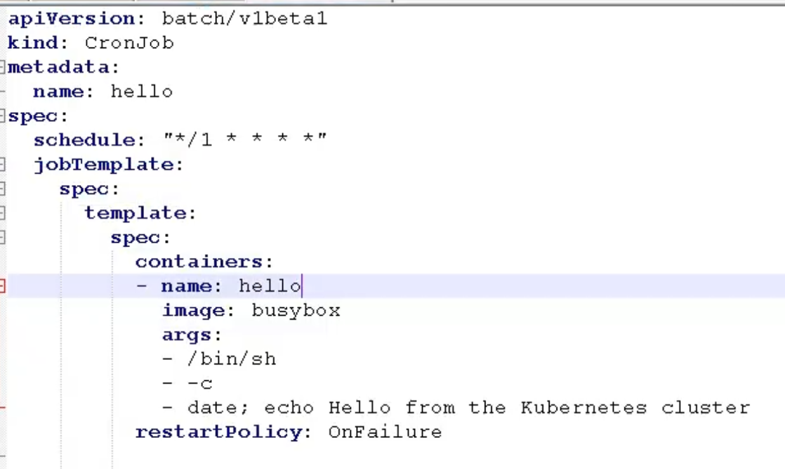
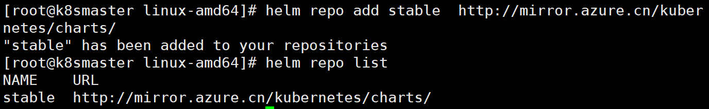
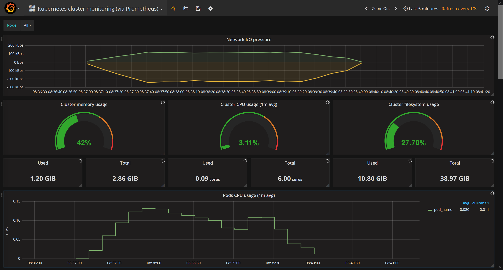

# Kubernetes

k8s是谷歌在2014年开源的容器化集群管理系统

+ 自动装箱 水平扩展 自我修复

  基于容器对应用环境进行自动部署

  当容器失败时会对容器进行重启，当所部署的Node节点有问题时会对容器进行重新部署和重新调度

  当容器未通过监控检查时，会关闭此容器直到正常运行时才会对外提供服务。

  通过简单的命令、用户UI界面或基于CPU等资源使用情况，对应用容器进行规模扩大或规模剪裁。

+ 服务发现和负载均衡

  Service

+ 自动发布和回滚

+ 集中化配置管理和密钥管理

+ 存储编排

+ 任务批处理运行

## 入门

### 四组概念

+ controller
  + 确保预期的pod副本数量
  + 无状态应用部署
    + 即插即用
  + 有状态应用部署
    + 依赖于存储或网络ip必须固定
  + 确保所有的node运行同一个pod
  + 一次性任务和定时任务

+ Pod/Pod控制器

  + Pod

    是k8s能够被运行的最小逻辑单元

    一个Pod里面可以运行多个容器 共享UTS NET IPC名称空间

    一个pod里运行多个容器 又叫sidecar

    共享网络：pod中的所有容器共享网络资源，比如容器A监听80端口，同在一个Pod下的容器B也会监听80端口

    生命周期是短暂的

  + Pod控制器

    Pod控制器是Pod启动的一种模板 用来保证在k8s里启动的Pod应始终按照人们的预期运行(副本数、生命周期、健康状态检查)

    Deployment

    DaemonSet （每个节点起一份）

    ReplicaSet   （Deployment管 ReplicaSet，ReplicaSet管pod）

    StatefulSet   （管理有状态应用的）

    Job

    Cronjob

+ Name/Namespace

  + Name

    由于K8S内部,使用“资源”来定义每一种逻辑概念(功能)故每种"资源”, 都应该有自己的"名称”

    "资源”有api版本( apiVersion )类别( kind )、元数据( metadata)、定义清单( spec)、状态( status )等配置信息

    "名称”通常定义在"资源”的"元数据”信息里

  + Namespace

    随着项目增多、人员增加、集群规模的扩大,需要- -种能够隔离K8S内各种"资源”的方法，这就是名称空间

    名称空间可以理解为K8S内部的虚拟集群组

    不同名称空间内的"资源”名称可以相同,相同名称空间内的同种“资源”，”名称” 不能相同

    合理的使用K8S的名称空间,使得集群管理员能够更好的对交付到K8S里的服务进行分类管理和浏览

    K8S里默认存在的名称空间有: default、 kube-system、 kube-public

    查询K8S里特定“资源”要带上相应的名称空间

+ Label/Label选择器

  + label

    标签是k8s特色的管理方式,便于分类管理资源对象。

    一个标签可以对应多个资源，一个资源也可以有多个标签,它们是多对多的关系。

    一个资源拥有多个标签,可以实现不同维度的管理。

    标签的组成: key=value(值不能多余64个字节字母数字开头 中间只能是 - _ .）

    与标签类似的,还有一种“注解” ( annotations )

  + label便签器

    - 给资源打上标签后,可以使用标签选择器过滤指定的标签

    - 标签选择器目前有两个:基于等值关系(等于、不等于)和基于集合关系(属于、不属于、存在)

    - 许多资源支持内嵌标签选择器字段

      matchLabels

      matchExpressions

+ Service/Ingress

  + Service

    在K8S的世界里,虽然每个Pod都会被分配一个单独的IP地址,但这个IP地址会随着Pod的销毁而消失

    Service (服务)就是用来解决这个问题的核心概念

    一个Service可以看作-一组提供相同服务的Pod的对外访问接口

    Service作用于哪些Pod是通过标签选择器来定义的

  + Ingress

    Ingress是K8S集群里工作在OSI网络参考模型下,第7层的应用,对外暴露的接口

    Service只能进行L4流量调度,表现形式是ip+port

    Ingress则可以调度不同业务域、 不同URL访问路径的业务流量


## 核心组件

配置存储中心→etcd服务

高可用奇数个

### 主控(master)节点

#### kube-apiserver

集群统一入口

- 提供了集群管理的RESTAPI接口(包括鉴权、数据校验及集群状态变更)交给etcd存储
- 负责其他模块之间的数据交互,承担通信枢纽功能
- 是资源配额控制的入口
- 提供完备的集群安全机制

#### kube-controller-manager

处理集群中常规的一些任务，一个资源对应一个控制器

- 由一系列控制器组成,通过apiserver监控整个集群的状态,并确保集群处于预期的工作状态

  Node Controller

  Deployment Controller

  Service Controller

  Volume Controller

  Endpoint Controller

  Garbage Controller

  Namespace Controller

  Job Controller

  Resource quta Controller

#### kube-scheduler

- 主要功能是接收调度pod到适合的运算节点上
- 预算策略( predict )
- 优选策略( priorities )

#### etcd

存储系统 用于保存集群相关的数据

### 运算(Worker)节点

#### kube-kubelet

- 简单地说, kubelet的主要功能就是定时从某个地方获取节点上pod的期望状态(运行什么容器、运行的副本数量、网络或者存储如何配置等等) ,并调用对应的容器平台接口达到这个状态
- 定时汇报当前节点的状态给apiserver,以供调度的时候使用
- 镜像和容器的清理工作，保证节点上镜像不会占满磁盘空间，退出的容器不会占用太多资源

#### Kube-proxy

- 是K8S在每个节点 上运行网络代理, service资源的载体
- **建立了pod网络和集群网络的关系**( clusterip >podip )
- 常用三种流量调度模式

  Userspace (废弃)

  Iptables (濒临废弃)（绝大部分公司在用）

  Ipvs(推荐)

- 负责建立和删除包括更新调度规则、通知apiserver自己的更新,或者从apiserver哪里获取其他kube- proxy的调度规则变化来更新自己的


## 搭建k8s

### kubeadm

|        |               |
| ------ | ------------- |
| master | 192.168.52.26 |
| node1  | 192.168.52.27 |
| node2  | 192.168.52.28 |

kubeadm是官方社区推出的一个用于快速部署kubernetes集群的工具。

这个工具能通过两条指令完成一个kubernetes集群的部署：

```
# 创建一个 Master 节点
$ kubeadm init

# 将一个 Node 节点加入到当前集群中
$ kubeadm join <Master节点的IP和端口 >
```

#### 1. 安装要求

在开始之前，部署Kubernetes集群机器需要满足以下几个条件：

- 一台或多台机器，操作系统 CentOS7.x-86_x64
- 硬件配置：2GB或更多RAM，2个CPU或更多CPU，硬盘30GB或更多
- 可以访问外网，需要拉取镜像，如果服务器不能上网，需要提前下载镜像并导入节点
- 禁止swap分区

#### 2. 准备环境

| 角色   | IP           |
| ------ | ------------ |
| master | 192.168.1.11 |
| node1  | 192.168.1.12 |
| node2  | 192.168.1.13 |

```
# 关闭防火墙
systemctl stop firewalld
systemctl disable firewalld

# 关闭selinux
sed -i 's/enforcing/disabled/' /etc/selinux/config  # 永久
setenforce 0  # 临时

# 关闭swap
swapoff -a  # 临时
sed -ri 's/.*swap.*/#&/' /etc/fstab    # 永久

# 根据规划设置主机名
hostnamectl set-hostname <hostname>

# 在master添加hosts
cat >> /etc/hosts << EOF
192.168.44.146 k8smaster
192.168.44.145 k8snode1
192.168.44.144 k8snode2
EOF

# 将桥接的IPv4流量传递到iptables的链
cat > /etc/sysctl.d/k8s.conf << EOF
net.bridge.bridge-nf-call-ip6tables = 1
net.bridge.bridge-nf-call-iptables = 1
EOF
sysctl --system  # 生效

# 时间同步
yum install ntpdate -y
ntpdate time.windows.com
```

#### 3. 所有节点安装Docker/kubeadm/kubelet

Kubernetes默认CRI（容器运行时）为Docker，因此先安装Docker。

##### 3.1 安装Docker

```
$ wget https://mirrors.aliyun.com/docker-ce/linux/centos/docker-ce.repo -O /etc/yum.repos.d/docker-ce.repo
$ yum -y install docker-ce-18.06.1.ce-3.el7
$ systemctl enable docker && systemctl start docker
$ docker --version
Docker version 18.06.1-ce, build e68fc7a
```

```
$ cat > /etc/docker/daemon.json << EOF
{
  "registry-mirrors": ["https://b9pmyelo.mirror.aliyuncs.com"]
}
EOF
```

##### 3.2 添加阿里云YUM软件源

```
$ cat > /etc/yum.repos.d/kubernetes.repo << EOF
[kubernetes]
name=Kubernetes
baseurl=https://mirrors.aliyun.com/kubernetes/yum/repos/kubernetes-el7-x86_64
enabled=1
gpgcheck=0
repo_gpgcheck=0
gpgkey=https://mirrors.aliyun.com/kubernetes/yum/doc/yum-key.gpg https://mirrors.aliyun.com/kubernetes/yum/doc/rpm-package-key.gpg
EOF
```

##### 3.3 安装kubeadm，kubelet和kubectl

由于版本更新频繁，这里指定版本号部署：

```
$ yum install -y kubelet-1.18.0 kubeadm-1.18.0 kubectl-1.18.0
$ systemctl enable kubelet
```

#### 4. 部署Kubernetes Master

在192.168.31.61（Master）执行。

```
$ kubeadm init \
  --apiserver-advertise-address=192.168.44.146 \
  --image-repository registry.aliyuncs.com/google_containers \
  --kubernetes-version v1.18.0 \
  --service-cidr=10.96.0.0/12 \
  --pod-network-cidr=10.244.0.0/16
```

由于默认拉取镜像地址k8s.gcr.io国内无法访问，这里指定阿里云镜像仓库地址。

使用kubectl工具：

```bash
mkdir -p $HOME/.kube
sudo cp -i /etc/kubernetes/admin.conf $HOME/.kube/config
sudo chown $(id -u):$(id -g) $HOME/.kube/config
$ kubectl get nodes
```

#### 5. 加入Kubernetes Node

在192.168.1.12/13（Node）执行。

向集群添加新节点，执行在kubeadm init输出的kubeadm join命令：

```
$ kubeadm join 192.168.1.11:6443 --token esce21.q6hetwm8si29qxwn \
    --discovery-token-ca-cert-hash sha256:00603a05805807501d7181c3d60b478788408cfe6cedefedb1f97569708be9c5
```

默认token有效期为24小时，当过期之后，该token就不可用了。这时就需要重新创建token，操作如下：

```
kubeadm token create --print-join-command
```

#### 6. 部署CNI网络插件

```
wget https://raw.githubusercontent.com/coreos/flannel/master/Documentation/kube-flannel.yml
```

默认镜像地址无法访问，sed命令修改为docker hub镜像仓库。

```
kubectl apply -f https://raw.githubusercontent.com/coreos/flannel/master/Documentation/kube-flannel.yml

kubectl get pods -n kube-system
NAME                          READY   STATUS    RESTARTS   AGE
kube-flannel-ds-amd64-2pc95   1/1     Running   0          72s
```

#### 7. 测试kubernetes集群

在Kubernetes集群中创建一个pod，验证是否正常运行：

```
$ kubectl create deployment nginx --image=nginx
$ kubectl expose deployment nginx --port=80 --type=NodePort
$ kubectl get pod,svc
```

访问地址：http://NodeIP:Port  

### 二进制包

#### 1.环境

#### 2.生成cfssl自签证书

#### 3.部署etcd集群

#### 4.为apiserver自签证书

#### 5.部署master相关组件

+ apiserver
+ controller-manager
+ scheduler

#### 6.部署node组件

+ docker
+ kubelet
+ kube-proxy

#### 7.部署CNI网络插件

### 核心技术

#### kubectl

```shell
kubectl create deployment nginx --image=nginx
kubectl expose deployment nginx --port=80 --type=NodePort
kubectl get pod,svc
```

#### yaml文件

k8s 集群中对资源管理和资源对象编排部署都可以通过声明样式（YAML）文件来解决，也就是可以把需要对资源对象操作编辑到 YAML 格式文件中，我们把这种文件叫做资源清单文 件，通过 kubectl 命令直接使用资源清单文件就可以实现对大量的资源对象进行编排部署 了。

+ 使用kubectl create命令生成yaml文件

  > kubectl create deployment web --image=nginx -o yaml --dry-run > my1.yaml

+ 使用kubectl get命令导出yaml文件

  > kubectl get deploy nginx -o=yaml --export > my2.yaml

#### pod

pod 是 k8s 系统中可以创建和管理的最小单元，是资源对象模型中由用户创建或部署的最 小资源对象模型，也是在 k8s 上运行容器化应用的资源对象，其他的资源对象都是用来支 撑或者扩展 Pod 对象功能的，比如控制器对象是用来管控 Pod 对象的，Service 或者 Ingress 资源对象是用来暴露 Pod 引用对象的，PersistentVolume 资源对象是用来为 Pod 提供存储等等，k8s 不会直接处理容器，而是 Pod，Pod 是由一个或多个 container 组成 Pod 是 Kubernetes 的最重要概念，每一个 Pod 都有一个特殊的被称为”根容器“的 Pause 容器。Pause 容器对应的镜 像属于 Kubernetes 平台的一部分，除了 Pause 容器，每个 Pod 还包含一个或多个紧密相关的用户业务容器

+ 创建容器使用docker 一个docker对应一个容器 一个容器有进程一个容器运行一个应用程序
+ pod是多进程设计 运行多个应用程序
+ 一个pod有多个容器一个容器里面运行一个应用容器
+ pod存在为亲密性应用
  + 两个应用之间进行交互 同一个pod中的容器相互访问可以使用localhost
  + 网络之间调用
  + 连个应用频繁

##### 共享网络

容器之间本身是相互隔离的 namespace group

实现机制：每个pod都会有个根容器 Pause再创建其他自己的容器，将自己的容器加入Pause容器中 这样所有的容器都住在同一个namespace 也共享网络 同一个ip mac地址 port

##### 共享存储

数据卷 使用数据卷进行持久化操作

数据持久化

+ 日志
+ 业务数据

##### 镜像拉取策略

IfNotPresent 只有镜像不存在时，才会进行镜像拉取。

Always 不管镜像是否存在都会进行一次拉取。

Never 不管镜像是否存在都不会进行拉取

##### 重启机制


##### 资源限制

```yaml
sepc
containers:
- name: db
image: mysql
resources:
requests:  #调度大小  最小申请的资源数量 limits是资源最大允许使用的量 不能突破
    memory: "64Mi"
    cpu: "250m"
limits:   # 最大
    memory: "128Mi"
    cpu: "500m
```

##### 健康检查

livenessProbe 存活检查

如果检查失败 就会杀死容器 根据Pod的重启策略操作

readinessProbe 就绪检查

如果检查失败 会把pod从service中移除

httpget exec tcpsocket

##### 创建pod流程

master节点

create pod -> apiserver -> etcd

scheduler -> apiserver -> etcd 调度算法将pod分配到一个node上

node节点

kubelet -> apiserver -> etcd 读取拿到分配给当前节点的pod -> 通过docker创建容器

##### pod调度属性

+ pod资源限制

  根据request 找到足够的node节点进行调度

+ 节点选择器标签

  > kubectl label node node1 env_role=dev

+ 节点亲和性 nodeAffinity

  + 硬亲和性

    约束条件必须满足

  + 软亲和性

    尝试满足

+ 污点和污点容忍

  Taint污点 不做普通的分配调度 是节点属性

  + 专用节点

  + 专用节点配置特点和硬件节点
  + 基于Taint驱逐

  > kubectl describe node k8smaster | grep Taint

  NoSchedule   一定不被调度

  PreferNoSchdule  尽量不被调度

  NoExecute 不会调度，并且还会驱逐Node已有Pod
  > kubectl create deployment web --image-nginx
  >
  > kubectl scale deployment web --replicas=5

  + 为节点添加污点

    > kubectl taint node k8snode1 env_role=yes:NoSchdule
    >
    > 删除污点
    >
    > kubectl taint node k8snode1 env_role:NoSchedule-

+ 污点容忍

#### Controller

+ 什么是controller

  在集群上管理和运行容器的对象

+ Pod和Controller之间的关系

  pod通过controller进行应用的运维，通过label标签建立关系

+ deployment控制器应用场景

  > 导出yaml文件
  >
  > kubectl create deplayment web --image=nginx --dry-run -o yaml > web.yaml
  >
  > 部署应用
  >
  > kubectl apply -f web.yaml
  >
  > 对外暴露端口号
  >
  > kubectl expose deployment web --port=80 --type=NodePort --target-port=80 --name=web1 -o yaml > web1.yaml
  >
  > kubectl apply -f web1.yaml

+ yaml 字段说明

+ deployment控制器部署应用

+ 升级回滚和弹性伸缩

  ```yaml
  # 设定版本
  apiVersion: apps/v1
  kind: Deployment
  metadata:
    creationTimestamp: null
    labels:
      app: web
    name: web
  spec:
    replicas: 1
    selector:
      matchLabels:
        app: web
    strategy: {}
    template:
      metadata:
        creationTimestamp: null
        labels:
          app: web
      spec:
        containers:
        - image: nginx:1.14
          name: nginx
          resources: {}
  status: {}
  ```

  > kubectl set image deployment web nginx=nginx:1.15

  > kubectl rollout status deployment web
  >
  > 查看升级版本
  >
  > kubectl rollout history deployment web
  >
  > 回滚上一个版本
  >
  > kubectl rollout undo  deployment web
  >
  > 指定回滚版本
  >
  > kubectl rollout undo  deployment web --to-revision=2
  >
  > 创建10个副本 弹性伸缩
  >
  > kubectl scale deployment web --replicas=10

#### service

> kubectl get pods -o wide

服务发现 防止pod失联

定义一组pod访问策略

pod和service关系

根据label和selector标签建立关联的

+ 常见service类型

  + ClusterIP

    集群内部进行使用

  + NodePort

    对外访问应用使用

  + LoadBalancer

    对外访问应用使用 公有云使用

无状态和有状态

无状态

+ 认为pod都是一样的
+ 没有顺序要求
+ 不用考虑在哪个node运行
+ 随意进行伸缩和扩展

有状态

+ 上面因素都需要考虑到
+ 让每个pod独立 并保持pod启动和唯一性
+ 有序 比如mysql主从

部署有状态pod `statefulset`

#### DaemonSet

部署守护进程DaemonSet

在每个node上面运行一个pod，新加入的pod也同时运行在一个node里面

> kubectl exec -it [podname] bash

#### Job

##### job

一次性任务

```yaml
apiVersion: batch/v1
kind: Job
metadata:
  name: pi
spec:
  template:
    spec:
      containers:
      - name: pi
        image: perl
        command: ["perl","-Mbignum=bpi","-wle","print bpi(2000)"]
      restartPolicy: Never
  backoffLimit: 4
```

> kubectl create -f job.yaml

##### cronjob

定时任务



> kubectl apply -f cronjob.yaml

#### Secret

对数据加密 并且存在`etcd`中 让pod以挂载Volume方式读写

```yaml
apiVersion: v1
kind: Secret
metadata:
  name: mysecret
type: Opaque
data:
  username: YWRtaW4=
  password: MWYyZDFlMmU2N2Rm
```

#### `ConfigMap`

存储不加密数据到`etcd`中让Pod以变量或者Volume挂载到容器中  使用场景：配置文件

#### `k8s`集群安全机制

认证->授权->准入控制

进行访问的时候 过程中都需要经过`apiserver`，`apiserver`做统一协调。访问过程中需要证书、token、或者用户名密码，如果访问pod现需要`serviceAccount`

传输安全 对外不暴露8080端口，只能内部访问，对外使用端口6443

认证：客户端身份认证常用方式：

+ `https`证书认证，基于ca证书
+ `http` token认证 通过token识别用户
+ `http` 基本认证 用户名+密码认证

授权

+ 基于`RBAC`进行授权操作
  + 角色
  + 角色绑定
  + 主体
+ 基于角色访问控制

准入控制

+ 准入控制列表 如果有请求内容则访问

#### Ingress

Ingress和pod通过service相关联的

> `kubectl` create deployment web --image=`nginx`
>
> `kubectl` expose deployment web --port=80 target-port=80 --type=`NodePort`

#### Helm

包管理工具，类似与`linux`中的yum，可以方便的将之前打包好的yaml文件部署到`k8s`上

+ helm可以对`yaml`文件进行一个整体管理
+ 实现`yaml`高效复用
+ 使用helm应用级别的版本管理

##### helm

命令行客户端工具

##### chart

把`yaml`打包，是`yaml`集合

##### Release

基于chart部署的实体，应用级别的版本管理

+ 仓库配置



+ 快速部署应用

  + 搜索相关应用

    > helm search repo [name]

  + 根据搜索到的内容 选择进行安装

    > helm install [name] [搜索之后应用的名称]
    >
    > 查看安装的状态
    >
    > helm list
    >
    > helm status [安装之后的名称]

#### 集群资源监控

+ 监控指标

  + 集群监控
    + 节点资源利用率 
    + 节点数
    + 运行的pods
  + pod监控
    + 容器指标
    + 应用程序

+ 监控平台

  + `prometheus+Grafana`

  + prometheus

    一套开源的监控、报警、数据库

    以HTTP协议周期性抓取被监控组件的状态

    不需要复杂的继承过程，使用http接口接入就可以

  + Grafana

    开源的数据分析和可视化工具

    支持多数据源

    


