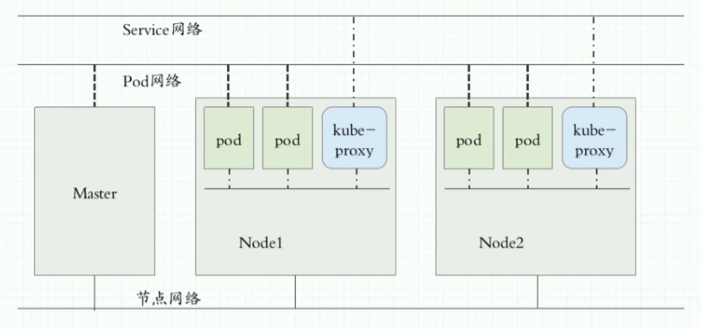
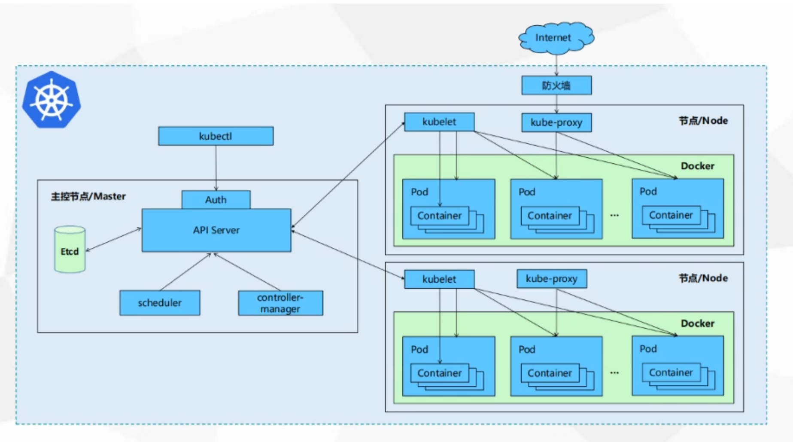

# Kubernetes
+ 自动装箱 水平扩展 自我修复
+ 服务发现和负载均衡
+ 自动发布和回滚
+ 集中化配置管理和密钥管理
+ 存储编排
+ 任务批处理运行

## 入门

### 四组概念

+ Pod/Pod控制器

  + Pod

    是k8s能够被运行的最小逻辑单元

    一个Pod里面可以运行多个容器 共享UTS NET IPC名称空间

    一个pod里运行多个容器 又叫sidecar

  + Pod控制器

    Pod控制器是Pod启动的一种模板 用来保证在k8s里启动的Pod应始终按照人们的预期运行(副本数、生命周期、健康状态检查)

    Deployment

    DaemonSet （每个节点起一份）

    ReplicaSet   （Deployment管 ReplicaSet，ReplicaSet管pod）

    StatefulSet   （管理有状态应用的）

    Job

    Cronjob

+ Name/Namespace

  + Name

    由于K8S内部,使用“资源”来定义每一种逻辑概念(功能)故每种"资源”, 都应该有自己的"名称”

    "资源”有api版本( apiVersion )类别( kind )、元数据( metadata)、定义清单( spec)、状态( status )等配置信息

    "名称”通常定义在"资源”的"元数据”信息里

  + Namespace

    随着项目增多、人员增加、集群规模的扩大,需要- -种能够隔离K8S内各种"资源”的方法，这就是名称空间

    名称空间可以理解为K8S内部的虚拟集群组

    不同名称空间内的"资源”名称可以相同,相同名称空间内的同种“资源”，”名称” 不能相同

    合理的使用K8S的名称空间,使得集群管理员能够更好的对交付到K8S里的服务进行分类管理和浏览

    K8S里默认存在的名称空间有: default、 kube-system、 kube-public

    查询K8S里特定“资源”要带上相应的名称空间

+ Label/Label选择器

  + label

    标签是k8s特色的管理方式,便于分类管理资源对象。

    一个标签可以对应多个资源，一个资源也可以有多个标签,它们是多对多的关系。

    一个资源拥有多个标签,可以实现不同维度的管理。

    标签的组成: key=value(值不能多余64个字节字母数字开头 中间只能是 - _ .）

    与标签类似的,还有一种“注解” ( annotations )

  + label便签器

    - 给资源打上标签后,可以使用标签选择器过滤指定的标签

    - 标签选择器目前有两个:基于等值关系(等于、不等于)和基于集合关系(属于、不属于、存在)

    - 许多资源支持内嵌标签选择器字段

      matchLabels

      matchExpressions

+ Service/Ingress

  + Service

    在K8S的世界里,虽然每个Pod都会被分配一个单独的IP地址,但这个IP地址会随着Pod的销毁而消失

    Service (服务)就是用来解决这个问题的核心概念

    一个Service可以看作-一组提供相同服务的Pod的对外访问接口

    Service作用于哪些Pod是通过标签选择器来定义的

  + Ingress

    Ingress是K8S集群里工作在OSI网络参考模型下,第7层的应用,对外暴露的接口

    Service只能进行L4流量调度,表现形式是ip+port

    Ingress则可以调度不同业务域、 不同URL访问路径的业务流量

## 核心组件

配置存储中心→etcd服务

高可用奇数个

### 主控节点

#### kube-apiserver

- 提供了集群管理的RESTAPI接口(包括鉴权、数据校验及集群状态变更)
- 负责其他模块之间的数据交互,承担通信枢纽功能
- 是资源配额控制的入口
- 提供完备的集群安全机制

#### kube-controller-manager

- 由一系列控制器组成,通过apiserver监控整个集群的状态,并确保集群处于预期的工作状态

  Node Controller

  Deployment Controller

  Service Controller

  Volume Controller

  Endpoint Controller

  Garbage Controller

  Namespace Controller

  Job Controller

  Resource quta Controller

#### kube-scheduler

- 主要功能是接收调度pod到适合的运算节点上
- 预算策略( predict )
- 优选策略( priorities )

### 运算(node)节点

#### kube-kubelet

- 简单地说, kubelet的主要功能就是定时从某个地方获取节点上pod的期望状态(运行什么容器、运行的副本数量、网络或者存储如何配置等等) ,并调用对应的容器平台接口达到这个状态
- 定时汇报当前节点的状态给apiserver,以供调度的时候使用
- 镜像和容器的清理工作，保证节点上镜像不会占满磁盘空间，退出的容器不会占用太多资源

#### Kube-proxy

- 是K8S在每个节点 上运行网络代理, service资源的载体
- **建立了pod网络和集群网络的关系**( clusterip >podip )
- 常用三种流量调度模式

  Userspace (废弃)

  Iptables (濒临废弃)（绝大部分公司在用）

  Ipvs(推荐)

- 负责建立和删除包括更新调度规则、通知apiserver自己的更新,或者从apiserver哪里获取其他kube- proxy的调度规则变化来更新自己的

